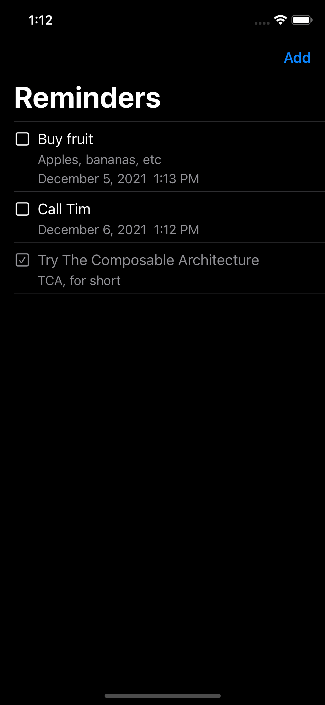
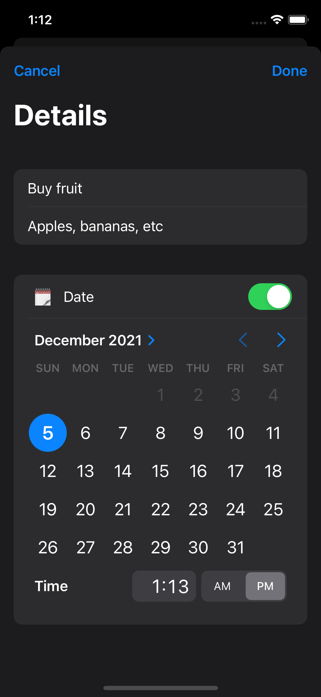
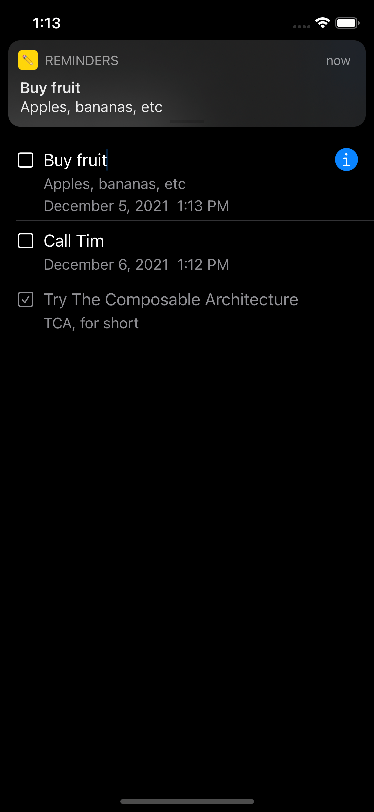
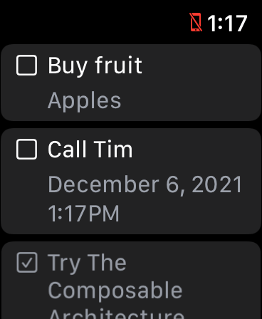

# Reminders

A simple app for trying [The Composable Architecture (TCA)](https://github.com/pointfreeco/swift-composable-architecture) written in SwiftUI to create, edit and complete reminders, getting scheduled local notifications:

Reminders list           |  Reminder detail  |  Local notification  |  WatchOS
:-------------------------:|:-------------------------:|:-------------------------:|:-------------------------:
|||

The app presents the following key features (which most of them are the same as the [Tic-Tac-Toe TCA example](https://github.com/pointfreeco/swift-composable-architecture/tree/main/Examples/TicTacToe)):
- Usage of the `UserNotifications` framework for generating notifications for scheduled reminders.
- Comprehensive test suite for every feature, including integration tests of features working in unison.
- Fully controlled side effects. Every feature is provided with all the dependencies it needs to do its work, which makes testing very easy.
- Highly modularized: every feature is isolated into its own module with minimal dependencies between them, allowing to compile and run features in isolation without building the entire application.
- The core logic of the application is put into modules named like `*Core`, and they are kept separate from modules containing UI, which is what allows us to share code across iOS and watchOS but also it could work for macOS and tvOS apps.

## Requirements
- iOS 14.5+ (Swift 5)
- Xcode 12.5.1

## Usage
1. Clone the repo
2. Open the workspace file `Reminders.xcodeproj`
3. Select an app target:
    - `Reminders` for iOS app
    - `RemindersWatch` for WatchOS app
4. Run the app

## Author
Luka Hristic

luka.hristic.dev@gmail.com

## License
MIT License

Copyright (c) 2021 Luka Hristic

Permission is hereby granted, free of charge, to any person obtaining a copy
of this software and associated documentation files (the "Software"), to deal
in the Software without restriction, including without limitation the rights
to use, copy, modify, merge, publish, distribute, sublicense, and/or sell
copies of the Software, and to permit persons to whom the Software is
furnished to do so, subject to the following conditions:

The above copyright notice and this permission notice shall be included in all
copies or substantial portions of the Software.

THE SOFTWARE IS PROVIDED "AS IS", WITHOUT WARRANTY OF ANY KIND, EXPRESS OR
IMPLIED, INCLUDING BUT NOT LIMITED TO THE WARRANTIES OF MERCHANTABILITY,
FITNESS FOR A PARTICULAR PURPOSE AND NONINFRINGEMENT. IN NO EVENT SHALL THE
AUTHORS OR COPYRIGHT HOLDERS BE LIABLE FOR ANY CLAIM, DAMAGES OR OTHER
LIABILITY, WHETHER IN AN ACTION OF CONTRACT, TORT OR OTHERWISE, ARISING FROM,
OUT OF OR IN CONNECTION WITH THE SOFTWARE OR THE USE OR OTHER DEALINGS IN THE
SOFTWARE.
